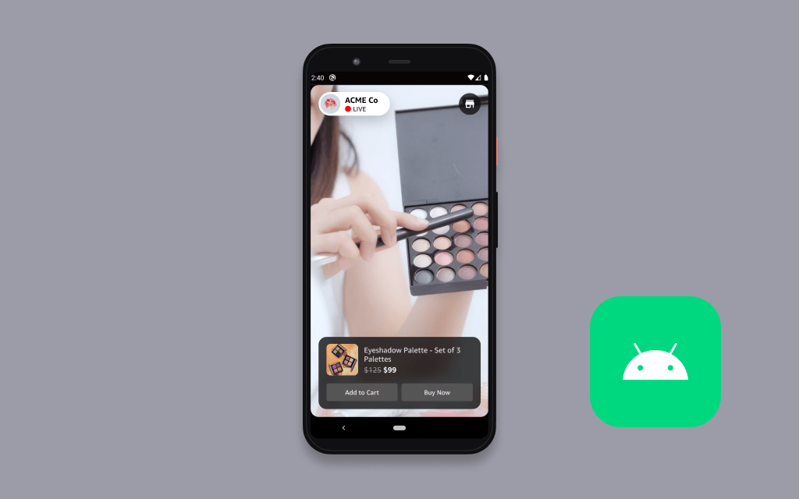

# Amazon IVS eCommerce Android demo

A demo mobile application intended as an educational tool for demonstrating how Amazon IVS can be used to build a compelling customer experience for eCommerce use-cases.



**This project is intended for education purposes only and not for production usage.**

This is a server-less Android application that uses only TimedMetadata to show products. The demo is written in [Kotlin](https://developer.android.com/kotlin) and showcases how customers can load and play an Amazon IVS stream and display browsable product information using TimedMetadata.

This demo uses a 24/7 looping stream which emits a TimedMetadata event every few seconds. These TimedMetadata events describe product information in json format, which is used by the app to show a carousel of products, and to highlight the product being shown on stream.

## Getting Started

To run this demo, you will need the following:<br>

1. [Android Studio](https://developer.android.com/studio), installed and up-to-date.
2. An Android Virtual Device (AVD) Phone with **API level 23 or later** (Android 6.0). Learn more here: [Run apps on the Android Emulator](https://developer.android.com/studio/run/emulator).

To run the demo in the Android emulator:

1. Using the command line, navigate to a directory of your choice (like `~/Developer`).
2. Clone the project from this repository: `git clone git@github.com:aws-samples/amazon-ivs-ecommerce-android-demo.git`.
3. Open the project in Android Studio.
4. Select an Android Virtual Device with API level 23 or later.
5. Choose `Run app` in the toolbar, or press `Ctrl-R`.

You should see the Android emulator boot up and launch the demo app. This may take a few moments to complete.

## Modifying this Example

### Prerequisites

**IMPORTANT NOTE:** Using your own stream will create and consume AWS resources, which will cost money.

1. Create and set up an Amazon IVS channel. [Getting started with Amazon IVS](https://docs.aws.amazon.com/ivs/latest/userguide/GSIVS.html).

### Using your own Live video

1. Open the [Amazon IVS Console](https://console.aws.amazon.com/ivs) and navigate to the channel you would like to use.
2. Copy the _Playback URL_ for the channel. The URL should end in `.m3u8`. (For example: `https://4da4a22026d3.us-west-2.playback.live-video.net/api/video/v1/us-west-2.298083573632.channel.WbhDQYgfYHoT.m3u8`).
3. In Android Studio, open the **app** `build.grade` (NOT the project build.gradle) file.
4. Replace the string between the escaped quotes on line `17` with the _Playback URL_ from step 2.
5. Save the file and Android Studio should show a banner that prompts you to sync the project. Click "Sync Now" to sync.
6. Save and build the application.

### Using your own TimedMetadata events

Amazon IVS TimedMetadata provides a way to embed metadata in an Amazon IVS stream. It ensures that your users receive the metadata at the same time as the video stream, regardless of stream latency or geographic location. Learn how to embed TimedMetadata in stream: [Embedding Metadata within a Video Stream](https://docs.aws.amazon.com/ivs/latest/userguide/SEM.html).

This example expects a `productId` that represents the unique identifier for a project in the `streams.json` file. A more scalable solution would be to store product information in [Amazon DynamoDB](https://aws.amazon.com/dynamodb/). This approach is documented in the [Amazon IVS eCommerce Web Demo](https://github.com/aws-samples/amazon-ivs-ecommerce-web-demo).

```
"metadata" : {
  "productId": "1000567892"
}
```

## Additional Notes

For production applications, we recommend using TimedMetadata alongside services like [AWS Lambda](https://aws.amazon.com/lambda/), [Amazon API Gateway](https://aws.amazon.com/api-gateway/), and [Amazon DynamoDB](https://aws.amazon.com/dynamodb/). These services will let you store and retrieve product information in a more scalable way. See the [Amazon IVS eCommerce Web Demo](https://github.com/aws-samples/amazon-ivs-ecommerce-web-demo) for example code using these services.

## Documentation

- [Amazon IVS Amazon Interactive Video Service (Amazon IVS)](https://aws.amazon.com/ivs/) is a managed live streaming solution that is quick and easy to set up, and ideal for creating interactive video experiences. Simply send your live streams to Amazon IVS and the service does everything you need to make ultra-low latency live video available to any viewer around the world, letting you focus on building interactive experiences alongside the live video. [Learn more](https://aws.amazon.com/ivs/).
- [Amazon IVS docs](https://docs.aws.amazon.com/ivs/)
- [User Guide](https://docs.aws.amazon.com/ivs/latest/userguide/)
- [API Reference](https://docs.aws.amazon.com/ivs/latest/APIReference/)

## Known Issues

- The application was written for demonstration purposes and not for production use.
- Currently only tested in the us-west-2 (Oregon) region. Additional regions may be supported depending on service availability.

## License

This sample code is made available under a modified MIT license. See the LICENSE file.
